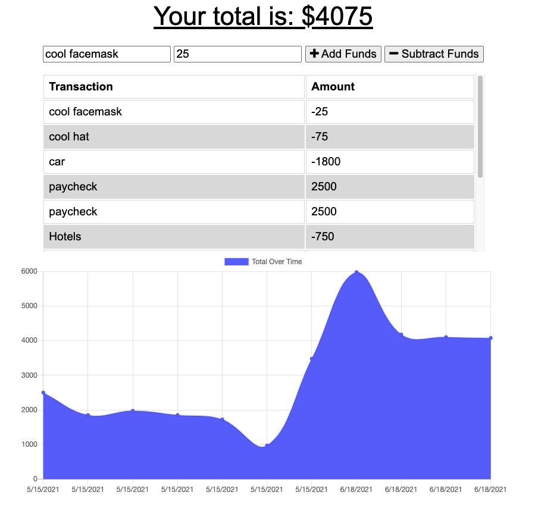

# Budget Minder

## Description

The user will be able to add expenses and deposits to their budget with or without a connection. When entering transactions offline, they should populate the total when brought back online.

## Built With

* [node.js](https://nodejs.org/en/)

* [express](https://expressjs.com/)

* [mongodb](https://www.mongodb.com/)

* [mongoose](https://mongoosejs.com/)

* [Morgan](https://www.npmjs.com/package/morgan)

* [sequelize](https://sequelize.org/)

* [javascript](https://developer.mozilla.org/en-US/docs/Web/javascript)

## Contributers

    William Farnsworth - [Github](https://github.com/Cynwise)
